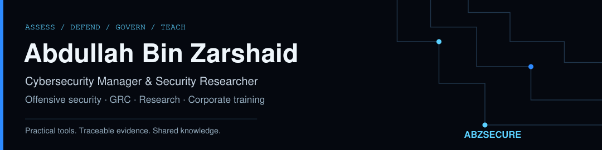

# Abdullah Bin Zarshaid

### Cybersecurity Manager & Security Researcher
**Information Security · GRC · Security Assessment · Corporate Training**

I work as a cybersecurity manager, combining hands-on security assessment with information-security governance, risk and compliance. My work spans web and API security, network security, practical tooling, research and teaching. This portfolio brings together tools I build, coauthored research and learning resources.

[**ABZSECURE**](https://abzsecure.com/) is my professional brand for security consultancy and training. Here on GitHub, I share the tools, research and learning materials behind my work.

**[Try PostureKit](https://github.com/abdullahzarshaid/posturekit)** · **[Try EvidenceGate](https://github.com/abdullahzarshaid/evidencegate)** · **[Read the handbook](https://github.com/abdullahzarshaid/network-security-assessment-handbook)**

  
  
  
  

## Choose your starting point

**Use a tool:** [PostureKit demo](https://github.com/abdullahzarshaid/posturekit/tree/main/examples) · [EvidenceGate demo](https://github.com/abdullahzarshaid/evidencegate/tree/main/examples)

**Learn the workflow:** [From Scope to Security Evidence](https://github.com/abdullahzarshaid/ethical-hacking-labs/tree/main/series)

**Explore the research:** [CWE613Study](https://github.com/abdullahzarshaid/CWE613Study)

- **[PostureKit](https://github.com/abdullahzarshaid/posturekit)** — Windows, directory and wireless configuration assessment: evidence collection, rule-based analysis and scanner imports.
- **[EvidenceGate](https://github.com/abdullahzarshaid/evidencegate)** — local integrity, HTTP capture-structure, CVSS and scope checks for security assessments.
- **[CWE613Study](https://github.com/abdullahzarshaid/CWE613Study)** — retained data, analysis and executable session-lifecycle examples.
- **[Network Security Assessment Handbook](https://github.com/abdullahzarshaid/network-security-assessment-handbook)** — methodology, worked scenarios and protocol reference.
- **[Ethical Hacking Labs](https://github.com/abdullahzarshaid/ethical-hacking-labs)** — 19 topic guides for isolated practice, with credited student examples.

## Research & contributions

**CWE proposal — explicit session termination**

I submitted *Improper Enforcement of Explicit Session Termination* to the CWE Program. The proposal is publicly tracked in the **[CWE Content Development Repository, issue #224](https://github.com/CWE-CAPEC/CWE-Content-Development-Repository/issues/224)**, submission **ES2609-7b54439f**.

**Status checked 25 September 2026:** receipt acknowledged (`Phase02-Ack-Receipt`); evaluation pending. This is a proposal, not an assigned or accepted CWE entry. The linked issue is the source for subsequent status changes.

**Session-lifecycle research**

*Logout Is Not Expiration: A Source-Aware Semantic Characterization of CWE-613*, with Shahbaz Akhtar Siddiqui — manuscript submitted to IEEE Access. **[Research materials and project notes](https://github.com/abdullahzarshaid/CWE613Study)**.

## Tools & technology

**Build & automate**

   &nbsp;
   &nbsp;
   &nbsp;
  

[Python](https://www.python.org/) · [PowerShell](https://learn.microsoft.com/powershell/) · [Bash](https://www.gnu.org/software/bash/) · [Git](https://git-scm.com/)

**Platforms & environments**

   &nbsp;
   &nbsp;
   &nbsp;
  

[Kali Linux](https://www.kali.org/) · [Linux](https://www.kernel.org/) · [Docker](https://www.docker.com/) · [Microsoft Azure](https://azure.microsoft.com/)

**Security assessment & analysis**

   &nbsp;
   &nbsp;
   &nbsp;
  

[Burp Suite](https://portswigger.net/burp) · [Nmap](https://nmap.org/) · [Wireshark](https://www.wireshark.org/) · [Metasploit](https://www.metasploit.com/)

Also in the assessment workflow: **[Greenbone / OpenVAS](https://www.greenbone.net/en/)** and **[Active Directory](https://learn.microsoft.com/windows-server/identity/ad-ds/get-started/virtual-dc/active-directory-domain-services-overview)**.

---

## How I approach the work

- **Evidence before conclusions.** Keep observations, interpretations and confirmed impact distinct.
- **Clear scope.** Assess only authorized systems; keep private engagement material out of public examples.
- **Useful artifacts.** Prefer inspectable Python and PowerShell, documented limits and reproducible examples.

## Across the security lifecycle

- **Assess & investigate:** Web and API security; network and wireless assessment; Windows, Active Directory and cloud configuration.
- **Govern & improve:** Information-security governance; risk assessment; control mapping; evidence quality and remediation tracking.
- **Teach & research:** Corporate training; practical labs; assessment methodology; reproducible security research.

Teaching materials retain contributor credit; research identifies its coauthors and publication status
in the project repository. My earlier master's work on SDN-enabled IoT security is being revisited;
it is not presented here as a new released tool or a published result.

## Useful community resources

[OWASP](https://owasp.org/) · [NIST Cybersecurity Framework](https://www.nist.gov/cyberframework) ·
[MITRE ATT&CK](https://attack.mitre.org/) · [PortSwigger Web Security Academy](https://portswigger.net/web-security)

These are independent third-party resources, not my projects or endorsements of my work.

## Connect

[LinkedIn](https://www.linkedin.com/in/abdullahbinzarshaid) · [Website](https://abzsecure.com/) · [ORCID](https://orcid.org/0009-0000-8354-5177) · [Email](mailto:abdullahbinzarshaid@gmail.com)

For a tool issue, please use its repository's issue tracker with a **synthetic, sanitized example**—never live credentials or client evidence.
